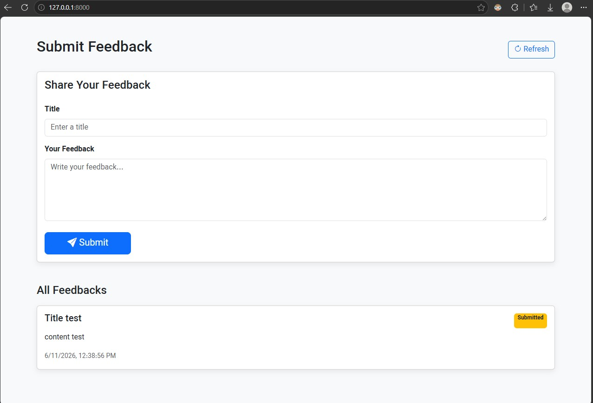
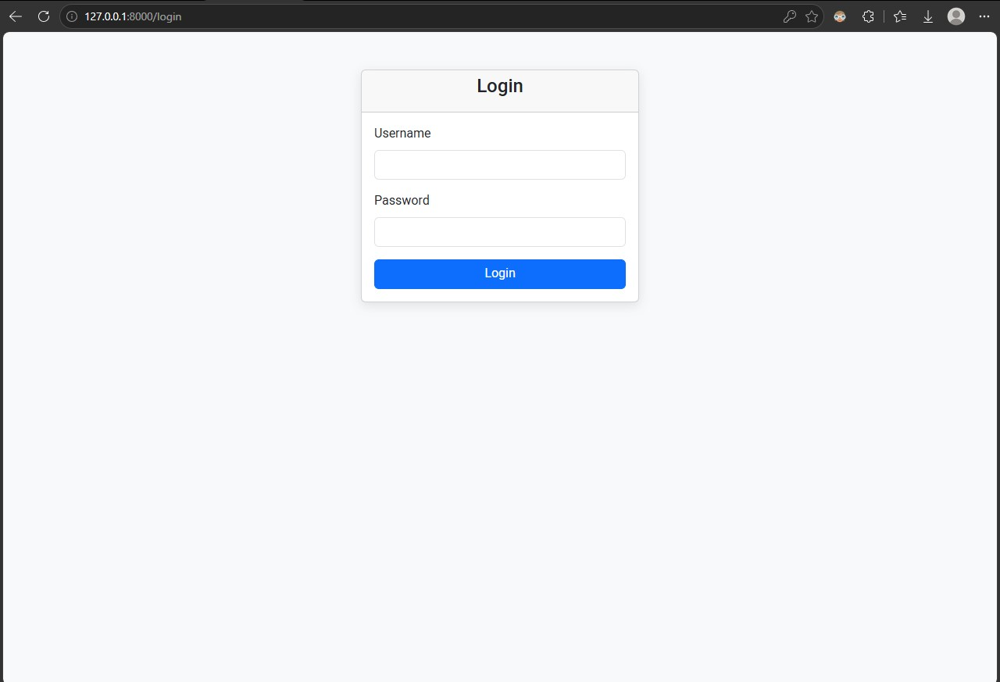
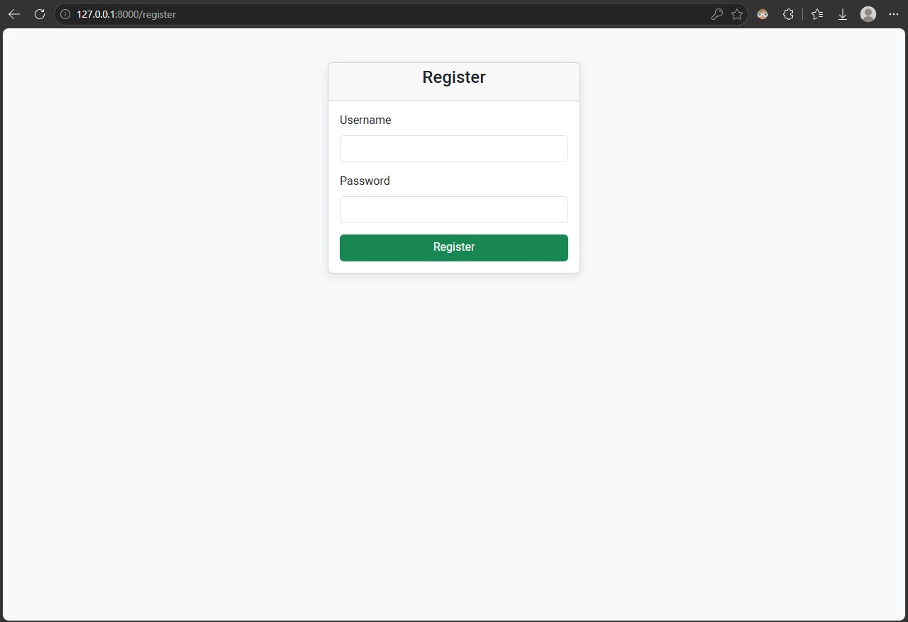
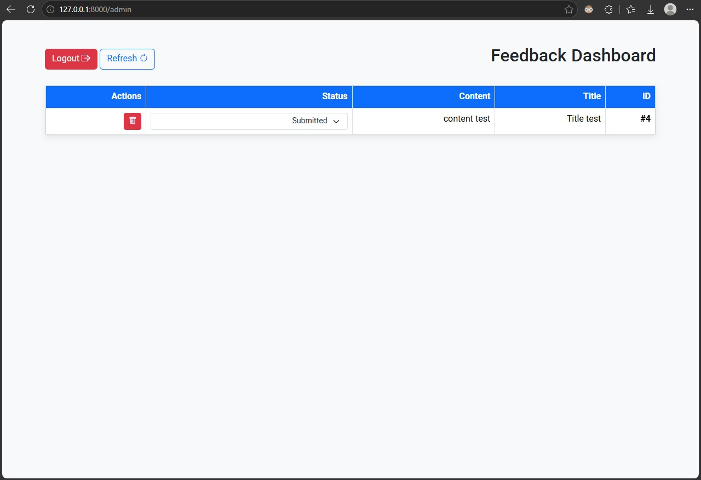
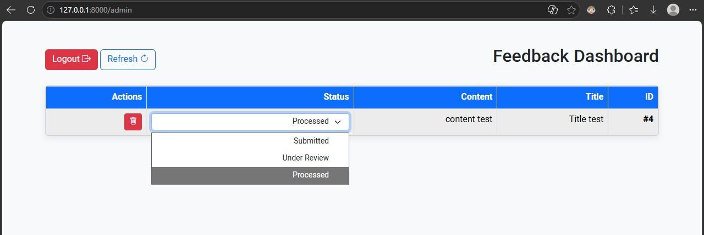
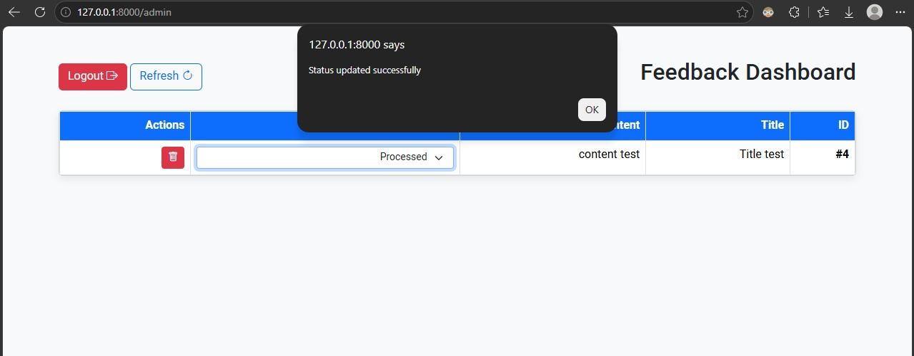
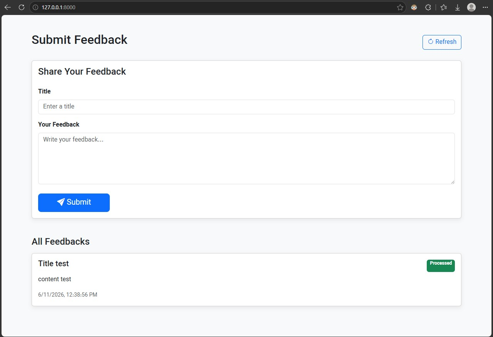

# سیستم مدیریت فیدبک (Feedback Board)

یک محصول ساده برای ثبت فیدبک توسط کاربران و مدیریت وضعیت آن‌ها توسط ادمین. این پروژه به عنوان تسک ورودی و برای ارزیابی مهارت‌های فنی توسعه داده شده است.

---

## 🛠️ ۱. تصمیم‌های فنی و انتخاب ابزارها

* **بک‌اند (`FastAPI`):** به خاطر سرعت بالا در توسعه، ساختار مدرن و سیستم اعتبارسنجی خودکار ورودی‌ها با `Pydantic` انتخاب شد.
* **احراز هویت (`JWT & bcrypt`):** برای امنیت داشبورد ادمین، از توکن‌های JWT و هش کردن رمز عبور با `bcrypt` استفاده شده است.
* **لایه داده (`PostgreSQL & SQLAlchemy`):** از دیتابیس قدرتمند و سازمانی `PostgreSQL` برای ذخیره‌سازی مطمئن داده‌ها استفاده شد. همچنین ابزار `SQLAlchemy ORM` وظیفه مدیریت روابط و اجرای کوئری‌ها را به صورت امن بر عهده دارد.
* **فرانت‌اند (`Bootstrap 5 RTL & Jinja2`):** فرانت‌اند مستقیماً با ابزار `Jinja2` به بک‌اند متصل شد. استایل‌دهی نیز با نسخه راست‌چین `Bootstrap 5` و فونت «وزیرمتن» انجام گرفت تا ظاهری تمیز، واکنش‌گرا و مرتب داشته باشیم.

---

## 📸 ۲. اسکرین‌شات‌های برنامه

### 🔹 صفحه ثبت فیدبک (کاربر)


### 🔹 صفحه لاگین


### 🔹 صفحه ثبت‌نام کاربر جدید


### 🔹 داشبورد ادمین (مدیریت فیدبک‌ها)


### 🔹 تغییر وضعیت فیدبک‌ها




---

##  ۳. راهنمای اجرای سریع پروژه

### قدم اول: کلون کردن پروژه
```bash
git clone https://github.com/afshario/feedback-board-task.git
cd feedback-board-task
```
### قدم دوم: نصب پکیج های مورد نیاز
```bash
pip install -r requirements.txt

```

### قدم سوم: اجرای پروژه بصورت لوکال
```bash
uvicorn main:app --reload
```

##  ۴. پیاده سازی با docker-compose

```bash
docker compose -f 'docker-compose.yaml' up -d
```